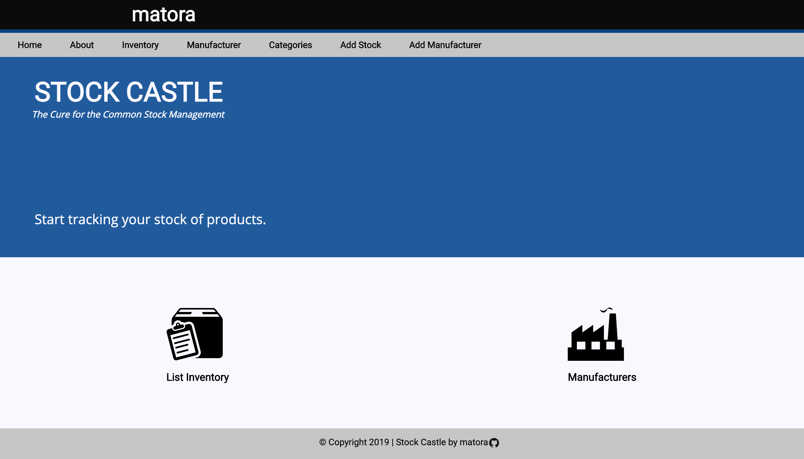
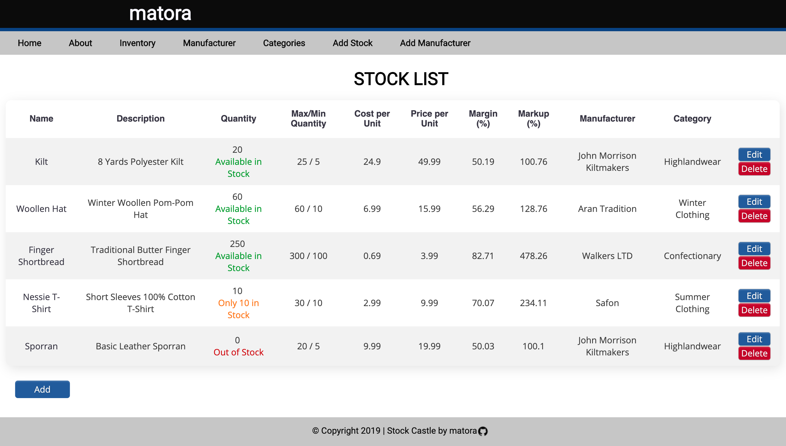
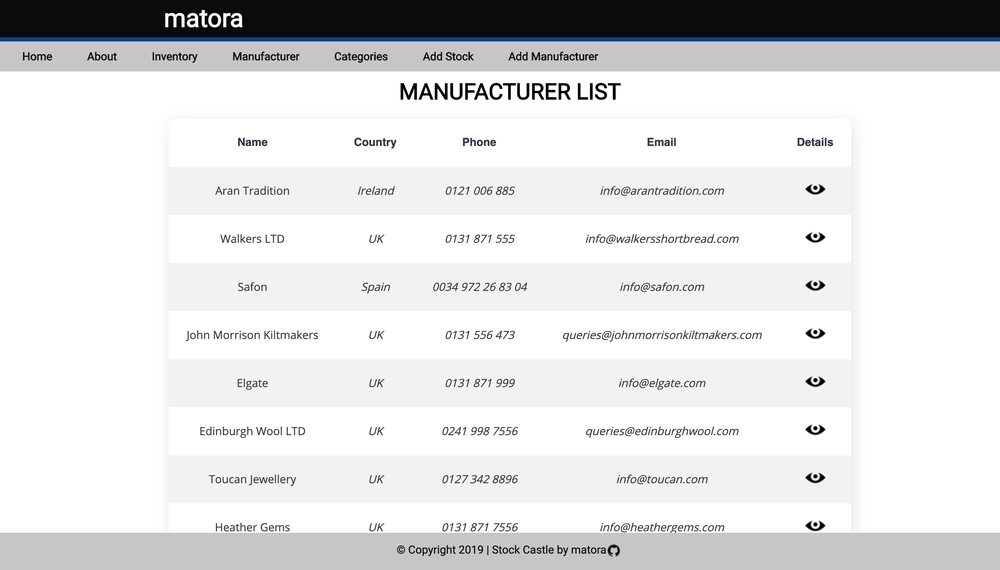

# Stock Castle

This is an admin/management app for shop workers which allows a shopkeeper to tracking their shop's stock of products.

## Basic Functionalities of this App
* The inventory is able to track individual products, including a name, description, stock quantity, minimun quantity, maximun quantity, buying cost and selling price.
* The inventory is able to also track manufactures, including a name, country, phone and email.
* The inventory can edit products (updating different attributes), delete and create products and manufacturers separately.
* The inventory can list all details for all the products in stock in a single view as well as visually display stock levels of products (such as, "Available in Stock", "Only X in Stock", "Out of Stock)

### User Stories

#### Manage stock

_As a shop keeper_ 
_I want to be able to view accurate information about my stock_ 
_So that I can keep my system up to date_ 

**Acceptance Criteria:** Shop keepers should be able to add new items to their list of stock.  
**Acceptance Criteria:** Shop keepers should be able to edit details of existing stock items in their list of stock.  
**Acceptance Criteria:** Shop keepers should be able to delete items from their list of stock.

#### Manage manufacturers

_As a shop keeper_ 
_I want to be able to see accurate information about the manufacturers whos stock I hold_ 
_So that I can keep track of details about my manufacturers_ 

**Acceptance Criteria:** Shop keepers should be able to add new manufacturers.  
**Acceptance Criteria:** Shop keepers should be able to remove manufacturers.
**Acceptance Criteria:** Shop keepers should be able to assign manufacturers to stock items.

#### View inventory

_As a shop keeper_ 
_I want to be able to view all of my stock at once_ 
_So that I can see at a glance what stock I currently have in store_ 

**Acceptance Criteria:** Shop keepers should be able to view all of their stock on a single page.

_As a shop keeper_ 
_I want to be highlighted to stock levels to be highlighted_ 
_So that I can be aware of low, medium and high stock levels for particular items_ 

**Acceptance Criteria:** Shop keepers should be able to view stock levels in a coded manner i.e colour (red/orange/green) or "Low"/"Medium"/"High".

## Extensions: Further Functionalities

* The inventory shows total cost of products as well total value of products.
* The inventory can calculate margin and markup of different products.
* The inventory has been filtered by manufacturer and by category so it can show what products belong to which manufacturer or category.
* The inventory can also show the representation of products for a specific category in percentage over the total of stock hold at that moment.

### User Stories

#### Calculate mark-up

_As a shop keeper_ 
_I would like to be able to see profit I am making on my inventory_ 
_So that I can adjust levels to make profit_ 

**Acceptance Criteria:** Stock items should have a cost price and a sell price.  
**Acceptance Criteria:** Shop keepers should be able to view a calculated mark up for all items. 

#### Search Functionality

_As a shop keeper_ 
_I would like to be able to filter stock items by manufacturer_ 
_So that I can see all stock items I hold for each manufacturer_ 

**Acceptance Criteria:** Create a filter dependant on the stock item's manufacturer

#### Categorisation

_As a shop keeper_ 
_I would like to group my stock by category_ 
_So that I can see the stock I hold from each category_ 

**Acceptance Criteria:** Products in stock should have a category 
**Acceptance criteria:** Shop keepers should be able to filter stock according to category 

